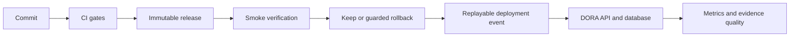

# dora-loop

A library that computes the four DORA metrics — deployment frequency, lead time
for changes, change failure rate, and time to restore — from deployment and
incident events.

**Status: CI builds, gates, deploys, and smoke-verifies the service on a private VM.**
The [first successful authenticated deployment](https://github.com/jjackson0118/dora-loop/actions/runs/34049531919/attempts/2)
completed on 2026-09-06. The served build identity matched the merged commit.
See [deployment evidence and setup](docs/wiki/Deployment.md).
The pipeline posts its own deployment events back into the service. The
[observed delivery loop](#observed-delivery-loop) records the live evidence.

## How this was built

Built over one weekend (4–6 September 2026, with review and documentation on
the 7th) by one person directing AI coding agents: Claude Opus 5 for
roughly 80% of the work, Codex (GPT-6 Astra) for the deployment path and
operational rehearsal after a mid-build handoff. The maintainer set scope and
acceptance criteria and decided what counted as done; the agents implemented
and reviewed each other's work adversarially.

**The comments are the history.** The long source comments were written by the
agents as each defect was found, and every one was left in on purpose: they are
the record of the AI build as it happened. Read them as history, not as style.
The full account is in
[delivery-gates: How it was built](https://github.com/jjackson0118/delivery-gates/wiki/How-It-Was-Built).

To reproduce the build and try the API without private infrastructure, follow
[the local quickstart](docs/wiki/Local-Quickstart.md).

## The rule everything else follows from

Zero observations produce `UNOBSERVED` — never `OK`, and never `0`. A change
failure rate of `0%` on a service with no recorded incidents reads as *perfect*
and means *nothing was measured*; those are opposite states, and a dashboard
that renders them identically hides the one you needed.

An unobserved metric serialises as `"value": null`, explicitly present, because
an omitted key deserialises to `0` in most typed clients. There is no boolean
health field, because a boolean cannot carry three states. Every metric carries
a `definitionOfWrong` describing how that particular number could mislead you.
All of it is asserted by tests, because all of it is one refactor from
silently reversing.

## What a report looks like

Nobody needs to build or deploy this to see the rule hold. This is the live
report for the service itself, captured on the deploy target on 2026-09-07 after
the pipeline had recorded five of its own deployments and no incidents
([full capture](docs/evidence/2026-09-07-live-report.json), including the
served build identity, the deployment event, its replay, and the refused
unauthenticated writes):

```json
{
  "service": "dora-loop",
  "metrics": [
    { "name": "deployment_frequency",  "state": "DEGRADED",   "value": 0.17, "unit": "deploys/day", "observedN": 5, "definitionOfWrong": "< 1.0 deploys/day" },
    { "name": "lead_time_for_changes", "state": "OK",         "value": 0.05, "unit": "hours",       "observedN": 5, "definitionOfWrong": "> 24.0 hours (median)" },
    { "name": "change_failure_rate",   "state": "OK",         "value": 0.0,  "unit": "percent",     "observedN": 5, "definitionOfWrong": "> 15.0 percent" },
    { "name": "time_to_restore",       "state": "UNOBSERVED", "value": null, "unit": "hours",       "observedN": 0, "definitionOfWrong": "> 24.0 hours (median)" }
  ],
  "summary": { "degraded": ["deployment_frequency"], "unobserved": ["time_to_restore", "data_quality.suspect_incidents"] }
}
```

Three lines carry the argument. `change_failure_rate` is `0.0` with
`observedN: 5` — a zero that five deployments stand behind. `time_to_restore`
is `null` with `observedN: 0` — no incident has ever been recorded, and the
service refuses to call that "0 hours". They look alike on every dashboard that
collapses them, and they mean opposite things. The third is
`deployment_frequency`: `DEGRADED`, because a demo that deploys five times in a
month is below the threshold it was given, and the report says so rather than
grading on a curve.

The same capture shows a service that has never been reported on returning
every metric `UNOBSERVED`, the last deployment event acknowledged `STORED`,
the same event replayed and acknowledged `DUPLICATE` with no row added, and a
write with no token — or the wrong one — refused with `403`.

## Build

Requires JDK 21 and an accessible Docker daemon for the PostgreSQL integration
tests. Gradle comes from the wrapper; first use downloads Gradle, dependencies
and container images. Core-only tests do not require Docker.

```bash
./gradlew build      # compile + test
./gradlew :core:test # core only
```

## Documentation

The [wiki](https://github.com/jjackson0118/dora-loop/wiki) is the long form. Its
pages are authored in [`docs/wiki/`](docs/wiki/) in this repository and published
by CI, so they are reviewed, versioned with the code, and checked by the `docs`
gate rather than living where no gate can reach them.

| | |
|---|---|
| [Why it exists](https://github.com/jjackson0118/dora-loop/wiki/Why-It-Exists) | The signal contract, and what it buys you. |
| [Verification](https://github.com/jjackson0118/dora-loop/wiki/Verification) | What is proven, how — and what is not. |
| [Authentication and exposure](https://github.com/jjackson0118/dora-loop/wiki/Authentication-And-Exposure) | What needs a token, what is open on purpose, and the limits. |
| [Replays and corrections](https://github.com/jjackson0118/dora-loop/wiki/Replays-And-Corrections) | Retries, rollbacks and resolutions arriving under an existing id. |
| [Layout and design](https://github.com/jjackson0118/dora-loop/wiki/Layout-And-Design) | Module boundaries and the build invariants that hold them. |
| [How it was built](https://github.com/jjackson0118/delivery-gates/wiki/How-It-Was-Built) | One weekend, one person, two AI agents — and why every comment stayed. |

## Decisions

Non-obvious choices are recorded in [`docs/adr/`](docs/adr/):

1. [Change failure rate joins incidents, it does not count failed rollouts](docs/adr/0001-change-failure-rate-joins-incidents.md)
2. [Lead time is measured per change, not per deployment](docs/adr/0002-lead-time-is-per-change.md)
3. [Implausible input is quarantined and surfaced, not rejected](docs/adr/0003-suspect-input-is-a-signal.md)
4. [Thresholds are a per-service value, not compiled-in constants](docs/adr/0004-thresholds-are-configurable.md)
5. [Verification is independent deployment evidence](docs/adr/0005-verification-is-independent-evidence.md)

## Review or reproduce

Start with the [local quickstart](https://github.com/jjackson0118/dora-loop/wiki/Local-Quickstart)
to build, test, and exercise the API without deployment credentials. For review,
follow the [design decisions](docs/adr/) and
[operational failure evidence](docs/operational-rehearsal.md). The
[delivery-gates repository](https://github.com/jjackson0118/delivery-gates)
contains the portable gate contract and fault proofs.



## Observed delivery loop

[CI run 34051994184](https://github.com/jjackson0118/dora-loop/actions/runs/34051994184)
on 2026-09-06 deployed the service and recorded its own `SUCCESS / VERIFIED`
event. Independent target, database, and report read-back agreed; replaying the
same payload returned `DUPLICATE` without adding a row. The
[deployment record](https://github.com/jjackson0118/dora-loop/wiki/Deployment)
contains the evidence and limits. Missing verification remains explicit in
`data_quality.unverified_deployments`.

## Roadmap

- Bounding the report query, which currently loads a service's whole history
  and windows it in memory.

Nothing here is published to the internet, deliberately. The gates that judge
this repository live in
[`delivery-gates`](https://github.com/jjackson0118/delivery-gates), which also
uses it as a fixture.

## License

Apache-2.0.
